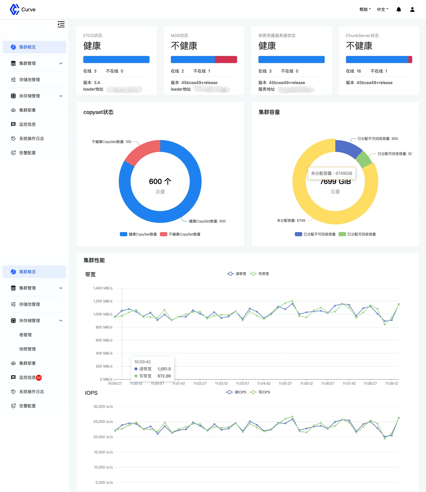

### English | [简体中文](README_cn.md)

## Background

As a storage foundation, Curve not only focuses on enriching its functionality and pursuing ultimate performance but also on **usability**. Curve-Manager is a relatively independent web service that provides web-based cluster management capabilities, reducing the deployment and management thresholds of storage clusters compared to CLI methods and providing a more clear and intuitive view.

Next, we will introduce from **architectural design**, **system features**, **compilation and packaging** and **deployment**.

## Architectural Design

The overall architecture of curve-manager is as follows, mainly composed of the control layer and the data layer, and the responsibilities of each module are as follows:

* User Management: Responsible for creating, viewing, managing permissions, and deleting system users.
* Data Management: Responsible for displaying cluster information and service statuses, cluster operations (volumes, snapshots, etc.), audit log management, and system alarm management.
* Deployment Management : Responsible for the visual deployment of the cluster, and deploys the cluster by sending requests to CurveAdm. The **_DB_** in the data layer mainly stores web system user information, audit logs, and storage system alarm information; **_Prometheus_** is a component of Curve cluster monitoring, which mainly provides monitoring data of storage clusters for the curve-manager; **_Curve Cluster_** is the core object accessed by the curve-manager, providing cluster information and receiving and processing cluster operation requests.


## System Features

### Main Features

**Multi-user and permission management**: The curve-manager supports multiple user accounts with different permissions (roles), and users can be added, deleted, modified, and queried through the UI. The password strength of the account is restricted and encrypted storage is used to improve the security of the account.

**Login restriction**: To meet different requirements for restricting storage system operations, the console provides flexible configuration, which can restrict only one user with write permission to log in at the same time, and restrict the same user from logging in multiple times on different machines. Each new login will force the previous one to log out.

**SSL/TLS support**: All HTTP communication between the web browser and the curve-manager is protected by SSL. An internally signed certificate can be used, but it is recommended to import a certificate signed by a CA in a production environment.

**Audit**: The curve-manager enables audit by default. Audit logs are recorded for all non-read operations in the system, making it easier to discover, analyze, and trace anomalous events.

**Multi-language support**: Currently, the system mainly supports Simplified Chinese and English.

### Core Monitoring and Management Functions

**Cluster Overview**: Provides a cluster-level view, including monitoring display of cluster health status, service status, capacity, and overall performance.

**Cluster Management**: Includes topology management, server management, and disk management. The cluster topology displays the hierarchical relationship between pool, zone, server, and chunkserver in the storage system and the detailed information at each level. Server management provides the management, basic information, and performance display of servers in the cluster, while disk management provides the management capability of disks on servers in the cluster.

**Storage Pool Management**: Provides a view at the storage pool level, including the basic information of the storage pool (attribute information, including serve, chunkserver, copyset, capacity, etc.).

**Block Storage Management**: Includes volume management and snapshot management. Volume management is for adding, deleting, modifying, and querying volumes, and similarly, snapshot management is for operations on snapshots in the storage system.

**Alarm Management**: Supports setting alarm rule information for the storage system, adding alarm recipients, receiving and viewing system alarm information, and configuring automatic deletion of expired information.

**Audit Management**: Provides display, filtering, and expiration deletion capabilities for audit information.

**Cluster Deployment**: This module is responsible for web-based deployment, receiving user cluster deployment requests, and forwarding the request to CurveAdm to complete the operation and return the result.

## Compilation and Packaging

```
# clone code
git clone --recursive git@github.com:opencurve/curve-manager.git

# go version >= v1.19.0
# build
make build

# make image
make image tag=<DOCKERHUB_USERNAME>/<REPOSITORY_NAME>:<TAG>
docker push <DOCKERHUB_USERNAME>/<REPOSITORY_NAME>:<TAG>
```

## Deployment and Usage

Deployment and usage reference: [Console Deployment and Usage Documentation](https://github.com/opencurve/curveadm/wiki/curve-website-deployment)

## Page Preview

Currently, the curve-manager is first adapted to CurveBS, and a few pictures can be used to preview it.

Login Page


Overview Page

